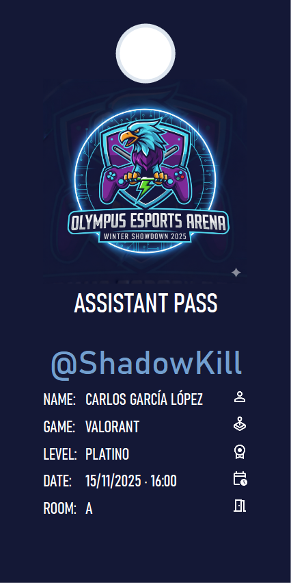

# COMBINACIÓN DE CORRESPONDENCIA
# ACTIVIDAD 1: Email de Confirmación - Torneo Esports 2026

---

## 📋 PREPARACIÓN DE DATOS Y DOCUMENTO BASE

### PARTE A: Crear la base de datos

**PASO 1:** Abre LibreOffice Calc

**PASO 2:** Crea esta tabla con **exactamente estos nombres de columna** (sin tildes, sin espacios):

| Nickname | Nombre | Apellidos | Email | Juego | Equipo | Rango | Fecha_Torneo | Hora | Sala |
|----------|--------|-----------|-------|-------|--------|-------|--------------|------|------|

**PASO 3:** Rellena con **AL MENOS 8 participantes** inventados. Ejemplo (puedes copiar y pegar):

| Nickname | Nombre | Apellidos | Email | Juego | Equipo | Rango | Fecha_Torneo | Hora | Sala |
|----------|--------|-----------|-------|-------|--------|-------|--------------|------|------|
| ShadowKill | Carlos | García López | carlos.garcia@email.com | Valorant | Night Wolves | Platino | 15/11/2026 | 16:00 | Sala Gaming A |
| LunaPro | Laura | Martínez Ruiz | laura.martinez@email.com | League of Legends | Phoenix Team | Oro | 15/11/2026 | 17:00 | Sala Gaming B |
| DragonSlayer | Miguel | Fernández Soto | miguel.fernandez@email.com | Fortnite | Solo | Diamante | 15/11/2026 | 16:30 | Sala Gaming A |
| QueenGamer | Ana | López Moreno | ana.lopez@email.com | Valorant | Valkyries | Oro | 15/11/2026 | 18:00 | Sala Gaming C |
| ElitePro99 | David | Sánchez Gil | david.sanchez@email.com | CS2 | Elite Squad | Global | 16/11/2026 | 16:00 | Sala Gaming A |
| NinjaStar | Paula | Rodríguez Vega | paula.rodriguez@email.com | League of Legends | Solo | Platino | 16/11/2026 | 17:30 | Sala Gaming B |
| ThunderBolt | Javier | Gómez Prieto | javier.gomez@email.com | FIFA 24 | Thunder FC | División 2 | 16/11/2026 | 16:00 | Sala Gaming C |
| PhoenixFire | Marta | Díaz Torres | marta.diaz@email.com | Fortnite | Phoenix Rising | Campeón | 16/11/2026 | 18:30 | Sala Gaming A |

**PASO 4:** Guarda el archivo como: `inscritos_torneo.ods`

**⚠️ IMPORTANTE:**
- Primera fila = nombres de campos (encabezados)
- Sin filas vacías
- Sin combinar celdas

---

### PARTE B: Crear el documento de email

**PASO 1:** Abre LibreOffice Writer (nuevo documento)

**PASO 2:** Escribe el siguiente texto (SIN los campos aún, solo el texto):

```
Para: [aquí irá el email]
Asunto: ✅ ¡Inscripción confirmada al Torneo Esports 2026!

─────────────────────────────────────────

Hola [nickname],

¡Bienvenido/a al Torneo Esports 2026!

Tu inscripción ha sido confirmada con los siguientes datos:

👤 DATOS DEL JUGADOR:
   Nombre completo: [nombre] [apellidos]
   Alias: [nickname]
   Email de contacto: [email]

🎮 DATOS DE COMPETICIÓN:
   Juego: [juego]
   Equipo: [equipo]
   Nivel/Rango actual: [rango]

📅 CONVOCATORIA:
   Día: [fecha]
   Hora de inicio: [hora]
   Ubicación: [sala]

⚠️ RECUERDA:
   ✓ Llega 15 minutos antes de tu hora
   ✓ Trae tu DNI o documento de identificación
   ✓ Si juegas en PC, puedes traer tu propio teclado/ratón/auriculares
   ✓ Consulta las reglas completas en: www.torneoesports2026.com

🏆 ¡Nos vemos en el torneo, [nickname]! Que gane el mejor.

Mucha suerte,
Equipo organizador
Torneo Esports 2026

─────────────────────────────────────────
```

**PASO 3:** Dale formato atractivo:
- Título en negrita y color
- Emojis (si quieres)
- Espaciado entre secciones

**PASO 4:** Guarda como: `email_confirmacion.odt`

---

## 📧 COMBINACIÓN DE CORRESPONDENCIA

### PARTE C: Vincular la base de datos

**En LibreOffice Writer:**

**PASO 1:** Menú → **Ver** → **Orígenes de datos**

**PASO 2:** Menú → **Archivo** → **Asistentes** → **Orígenes de datos de direcciones**

**PASO 3:** Selecciona "Otro origen de datos externo"

**PASO 4:** Busca y selecciona tu archivo `inscritos_torneo.ods`

**PASO 5:** Verifica que se vean todos los registros en la parte superior de la pantalla

---

### PARTE D: Insertar campos de combinación

**PASO 1:** Coloca el cursor donde pone `[aquí irá el email]`

**PASO 2:** Menú → **Insertar** → **Campos** → **Otros** (Ctrl+F2)

**PASO 3:** Pestaña **Base de datos** → Selecciona el campo **Email** → botón **Insertar**

**PASO 4:** Repite para cada campo:
- `[nickname]` → insertar campo **Nickname**
- `[nombre]` → insertar campo **Nombre**
- `[apellidos]` → insertar campo **Apellidos**
- `[email]` → campo **Email**
- `[juego]` → campo **Juego**
- `[equipo]` → campo **Equipo**
- `[rango]` → campo **Rango**
- `[fecha]` → campo **Fecha_Torneo**
- `[hora]` → campo **Hora**
- `[sala]` → campo **Sala**

---

### PARTE E: Previsualizar y generar

**PASO 2: Generar documentos**

**Opción A - Documento único con todos los emails:**
- Menú → **Herramientas** → **Asistente para combinar correspondencia**
- Elegir "Documento"
- Se creará un documento con todos los emails separados por saltos de página

**Opción B - Emails individuales:**
- Guardar como PDF individuales
- O imprimir directamente

**PASO 3:** Guarda el resultado final

---

## 📦 A ENTREGAR

1. ✅ Archivo `inscritos_torneo.ods` con los datos
2. ✅ Archivo `email_confirmacion.odt` con campos insertados
3. ✅ Archivo `emails_generados.pdf` con todos los emails combinados

---

# ACTIVIDAD 2: Carnet de asistente - Torneo Esports 2026

Debes diseñar en Writer un carnet similar al mostrado en la imagen siguiente:



**Indicaciones:**
- **Tamaño del papel:** anchura 7,5 cm y altura 15 cm
- **Márgenes:** izquierda y derecha 1 cm, arriba y abajo 0,5 cm
- **Color de fondo:** h141836
- **Tipos de letra:** Bahnschrift y Bahnschrift Condensed

Una vez tengas hecho el diseño, **inserta los campos de combinación** en el lugar correspondiente para crear un carnet para cada asistente al torneo. En este caso debes usar: _Nickname, Nombre, Apellidos, Juego, Rango, Fecha_Torneo, Hora y Sala_.

Los iconos los puedes obtener de [Google Fonts](https://fonts.google.com) > Icons.

---

## 📦 A ENTREGAR

1. ✅ Archivo `carnet.odt` con campos insertados
2. ✅ Archivo `carnets_generados.pdf` con todos los carnets combinados
